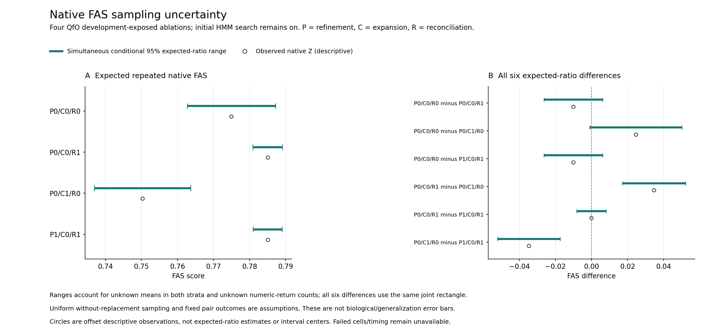

### Conditional Native FAS Sampling Figure

Figure. Native FAS sampling uncertainty in four admitted QfO ablations.
Panel A shows simultaneous conditional 95% ranges for expected repeated native
post-attrition FAS; offset open circles show the actual descriptive native Z.
Panel B shows all six expected-ratio difference ranges; its offset circles
show observed differences of Z, not expected-difference point estimates.
Bars have no fitted central estimate. The dashed line marks zero. Four
difference ranges include zero, including the reconciliation and additional
profile-refinement contrasts; inclusion is not equivalence. Two ranges
exclude zero for R-on versus candidate-expanded R-off, without isolating a
single-component causal effect. Labels preserve original contrast orientation.

The same joint rectangle covers four cells and six contrasts, using three
components per cell with error 0.05/12 each. Both finite-population stratum
means and the number of numeric-return missing pairs are unknown. The
construction assumes uniform without-replacement within-cell sampling and
fixed pair outcomes, not biological pair/family IID, cross-cell independence
or missing-at-random outcomes. This is conditional sampling uncertainty in
development-exposed QfO data, not biological generalization or overall accuracy
superiority. Initial HMM search stays on; P denotes profile refinement, C
candidate expansion, R reconciliation. Three failed native cells and the
failed P0/C0/R1 timing remain unavailable. No inference/scoring/sample was rerun.

The figure source was committed/pushed before production rendering. All 19
focused tests passed; actual PNG, SVG and PDF rendering completed once. Scoped
readback verifies all four original rows and six contrasts, four zero-overlap
ranges, output hashes, vector labels and 2900x1360 raster dimensions with
147168 nonwhite pixels. Actual visual inspection found no overlapping or
cropped labels/captions. This does not render or certify the complete manuscript.

[Editable SVG](native_factorial_fas_sampling_figure_20261010_v1/native_factorial_fas_sampling.svg),
[vector PDF](native_factorial_fas_sampling_figure_20261010_v1/native_factorial_fas_sampling.pdf),
[plotted values and provenance](native_factorial_fas_sampling_figure_20261010_v1/figure.json),
[actual render/readback](native_factorial_fas_figure_execution_20261010_v1.json).
