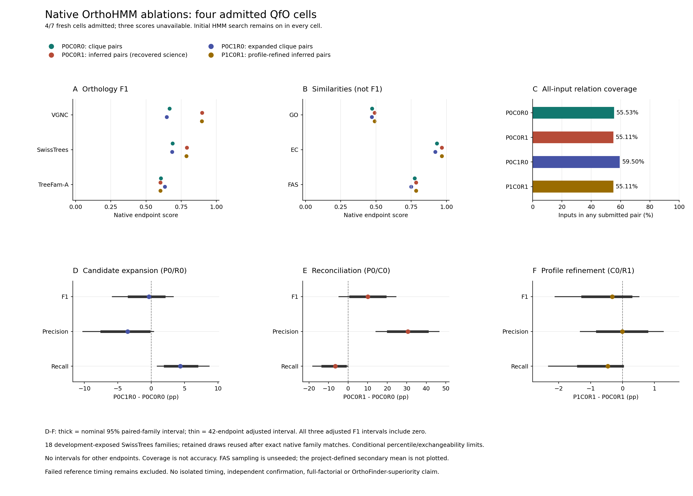

# Four Admitted Native QfO Cells

This chronological manuscript supplement adds the newly independently
admitted P1C0R1 profile-refinement cell to the previous three-cell result.
It supplements the frozen main text and all-tool comparisons; it does not
overwrite older figures, manuscript bytes or archives. QfO and OrthoBench
remain development-exposed primary benchmarks; Three Kingdoms is supplementary.

## Figure And Source Tables

**Figure.** Native OrthoHMM endpoint results, all-input relation coverage and
three conditional SwissTrees contrasts. P denotes downstream profile
refinement, C candidate expansion and R phylogenetic reconciliation. Initial
HMM search stays on in every displayed cell; this is not a total-HMM ablation.
P0C0R0 and P0C1R0 use cross-species orthogroup-clique pairs. P0C0R1 and P1C0R1
use native phylogenetically inferred pairs. Panels A/B separate the three F1
endpoints from the three functional similarities. Panel C uses all984137
input accessions as denominator and is coverage, not accuracy or reference
recall. Panels D-F show candidate expansion at P0/R0, reconciliation at P0/C0
and profile refinement at C0/R1, respectively. These are condition-specific
effects, not interchangeable main effects or interactions. Thick intervals
are nominal95% paired-family percentiles; thin intervals retain adjustment
over all42 planned endpoints. All three adjusted F1 intervals include zero.

Exact generated values are available in the
[24 endpoint rows](native_qfo_four_cell_figure_20261007_v1/scores.tsv),
[four coverage/precision-recall rows](native_qfo_four_cell_figure_20261007_v1/coverage.tsv),
and [nine interval rows](native_qfo_four_cell_figure_20261007_v1/swiss_intervals.tsv).
The [complete seven-identity table](native_qfo_scientific_scores_20261007_v3/scores.md)
also includes the project-defined secondary six-metric mean and explicit
unavailable cells. This arithmetic mean is not official QfO F1 and is not
plotted as an accuracy endpoint. Vector assets are the
[PDF](native_qfo_four_cell_figure_20261007_v1/native_qfo_four_cell.pdf) and
[SVG](native_qfo_four_cell_figure_20261007_v1/native_qfo_four_cell.svg).

## New Conditional Finding

P1C0R1 has SwissTrees F1 0.7863721859036304 compared with
0.7895743384374164 for P0C0R1. The matched count-derived difference is
-0.320215 percentage points, with adjusted interval[-2.112886,0.513227].
One family improves,16tie and one worsens. The
[independent uncertainty readback](NATIVE_QFO_PROFILE_UNCERTAINTY_RESULT_20261007.md)
confirms complete native family/label records and exact rational arithmetic;
retained intervals are reused after exact matches, not independently refitted.
The [new mechanism supplement](NATIVE_PROFILE_LOCALIZATION_RESULT_20261007.md)
checks every changed scored pair: three CASP false positives disappear and one
GH14 true positive is lost, all through candidate-family separation before
reconciliation. Six saved family checkpoints/70leaves and the two before-state
speciation LCAs independently agree. Inferred species-tree bytes also differ.
Individual profile-edge causality and biological correctness remain unproved.

## Validation And Provenance

The plotter/reviewer/tests/protocol were committed/pushed at d9e8b807 before
one selected render and one selected content review. The
[manifest](native_qfo_four_cell_figure_20261007_v1/manifest.json), SHA256
`4732f525575b03d548bdf18a4047625b565ac1f28df005513d9457ac86f36d75`,
binds the actual allocated scientific snapshot, interval binding, independent
rational readback, source files and generated assets. Its explicit scientific
Python3.10 subprocess successfully replays reporting metadata using unchanged
allocated helpers. Rendering uses Python3.12/Matplotlib3.10.8. This is metadata
and presentation work, not transitive raw admission, scoring or bootstrap.

The [separate content reader](native_qfo_four_cell_figure_readback_20261007_v1.json),
SHA256 `71aa0807750223a22f7e6080db4de01a3a9f7ccae69c9d2ff5170418c514b614`,
checks all TSV values directly against snapshot/binding without the plotting
data function. It checks all four cell colors, the2960x2120PNG, SVG/decoded PDF
scope labels and PDF text bounds, then generates an actual decoded PDF preview.
Both actual PNG and preview were viewed; the
[visual inspection record](NATIVE_FOUR_CELL_FIGURE_VISUAL_REVIEW_20261007.md)
records no observed clipping or overlap. Automated content checks alone do
not certify visual quality; frozen manifests are not rewritten after inspection.

The selected plot exits0/8.98s/516088KiB maximum RSS/zero swaps; its
[receipt](native_four_cell_plot_execution_20261007_v1.json) retains the exact
command/stdout/time. Selected review exits0/5.66s/148776KiB RSS/zero swaps,
retained in its [receipt](native_four_cell_review_execution_20261007_v1.json).
These are presentation/replay costs, not native inference timings. Joined
new/old figure tests pass107cases in13.23s; the old three-cell source and
assets remain unchanged. See the
[prospective protocol](NATIVE_FOUR_CELL_FIGURE_PROTOCOL_20261007.md) for scope.
Exact commands in execution receipts reproduce this presentation using fresh
destinations; no new native inference, conversion, scoring or bootstrap is
necessary. Preserve existing selected outputs and bound source bytes.

## Limits And Unfinished Work

Only four of seven fresh native score identities are independently admitted.
P0C1R1, P1C1R0 and P1C1R1 have unavailable scores in this fixed snapshot,
not zeros or estimates; native9's failed outcome remains retained. Eleven of
14 contrasts are unsupported with null metrics. Current running job state
belongs in the progress ledger rather than this frozen score presentation.
P1C1R0 and P1C1R1 still require successful inference/review/conversion/scoring/
admission before completing the remaining authorized native comparisons.

SwissTrees uncertainty is conditional on18 development-exposed families,
exchangeability and approximate percentile coverage. No validated intervals
are attached to the other five endpoints or secondary mean. Unseeded FAS
sampling and missing-score attrition remain limitations. The recovered
reference's native measurement failure is not repaired by accuracy admission;
its resource values remain null and timing-ineligible. The figure makes no
isolated speed, independent confirmation, default-promotion, full-factorial,
universal generalization, OrthoFinder-superiority or publication-ready claim.

Timing measurements were collected on a shared Threadripper while other
analyses were running. Competition for CPU, memory bandwidth and I/O may
have affected elapsed times, with an unknown and potentially tool-dependent
impact. These are observed shared-host timings, not estimates of isolated
performance.
