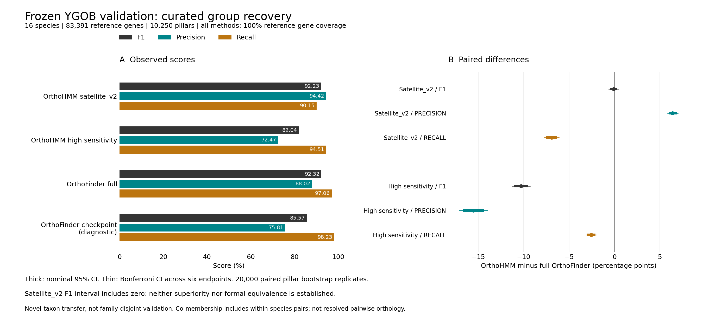
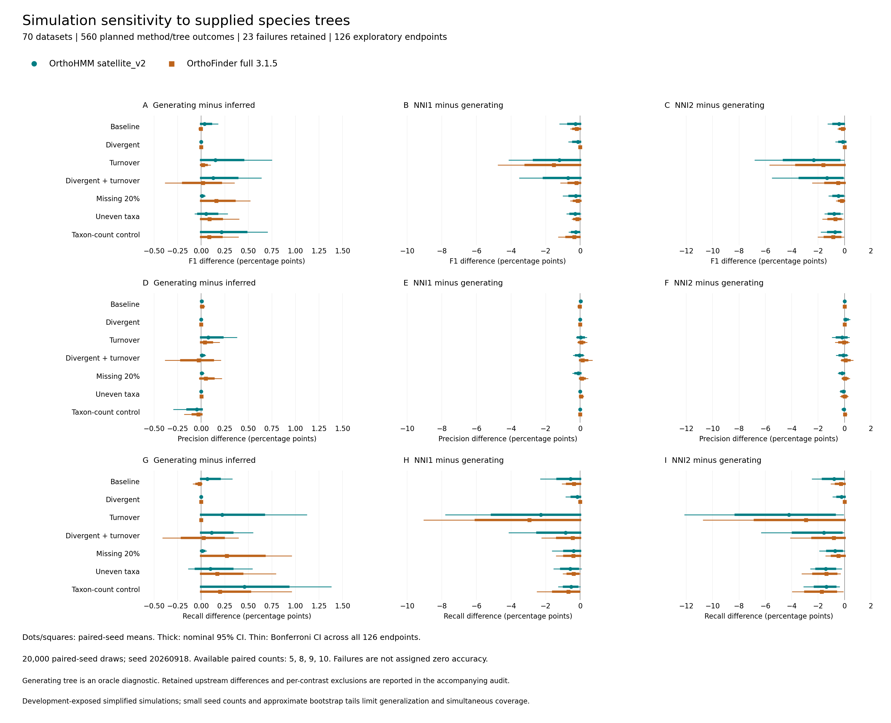
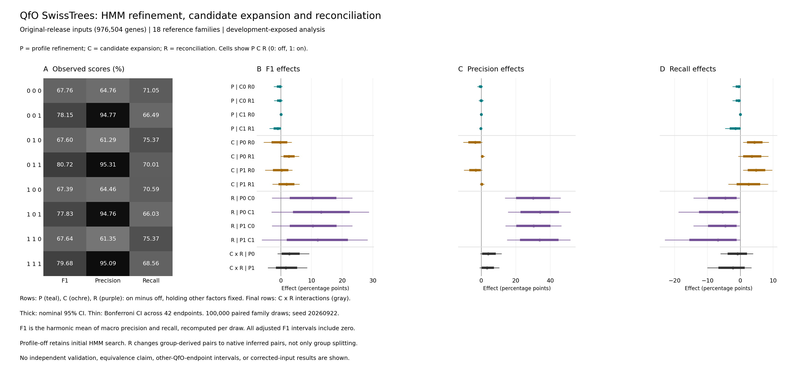
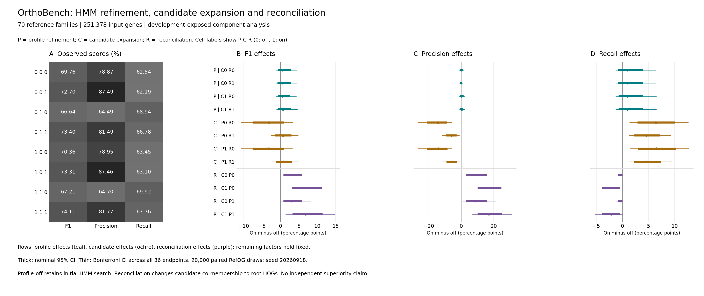
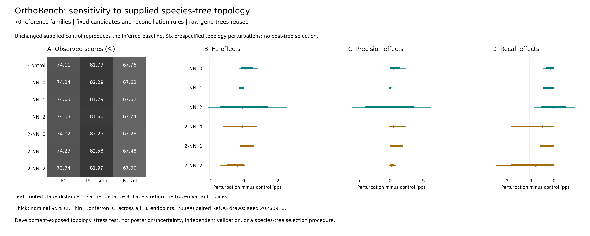
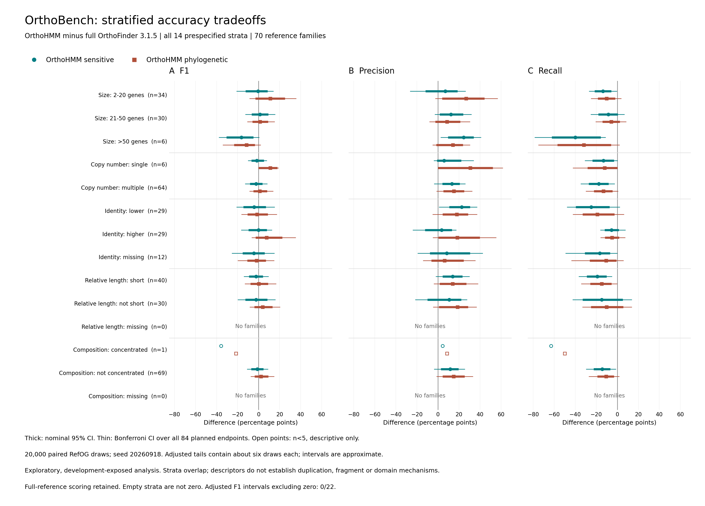

# OrthoHMM: HMM-Centered Orthogroup Inference And Phylogenetic Refinement

Working manuscript, updated 18 September 2026. Not submission-ready. Sections below
distinguish completed development-exposed analyses from prospective work.
Internal evidence links are supplied for audit. An initial
[verified literature bibliography](PUBLICATION_REFERENCES_20260917.md)
covers benchmarks, biological evidence and retained comparator methods;
An [eight-dependency supplement](PUBLICATION_DEPENDENCY_REFERENCES_20260918.md)
covers the simulator and selected search, alignment, clustering and tree
methods. A [clustering and analysis supplement](PUBLICATION_NUMERIC_REFERENCES_20260918.md)
adds Leiden, CPM, NumPy, Biopython and Matplotlib. Remaining dependency/resource citations and journal-specific
formatting are incomplete.

## Study Objective

We evaluate an HMM-centered approach to orthogroup inference and its
integration with phylogenetic refinement. The principal questions are whether
profile-based expansion contributes measurable recovery beyond the initial
search, whether broader candidate groups improve reconciliation, and how
accuracy and computational costs compare with established tools. These
questions are not equivalent to asking whether a single aggregate score is
maximized. We distinguish homolog-group recovery, resolved ortholog-pair
prediction, and conserved-family recovery throughout the study.

## Methods

### Configurations And Comparator Outputs

The retained OrthoHMM configurations are high sensitivity and the
satellite_v2 phylogenetic pipeline. The prospective validation configuration
is pinned to source revision `7f3a9e4`, with BLOSUM62, E-value threshold
1e-4, Leiden CPM resolution 0.1, seed 4, and the default refinement profile.
The Leiden optimizer is described by [Traag et al. (2019)](https://doi.org/10.1038/s41598-019-41695-z)
and the CPM objective by [Traag et al. (2011)](https://doi.org/10.1103/PhysRevE.84.016114).
These clustering references do not imply biological orthology guarantees.
The phylogenetic configuration uses satellite_v2 candidate expansion,
an internally inferred species tree, minimum-variance species-tree rooting,
the species-overlap root rule, and positive-paralogy pair inference.
Historical runs retain their actual source and configuration records; the
prospective pin must not be retroactively attributed to them.
See the [frozen validation protocol](YGOB_VALIDATION_PROTOCOL_20260916.md).
The original OrthoHMM lineage is cited as the
[Steenwyk et al. (2024) preprint](https://doi.org/10.1101/2024.12.07.627370);
the implementation examined here includes later changes that require
the source/runtime description rather than attribution to that preprint alone.

The [method diagram](figures_publication_method_20260916/publication_method.pdf)
distinguishes initial HMM search, cluster-profile expansion, high-sensitivity
orthogroups, candidate-family construction, gene/species-tree inference and
constraint-guided membership decisions. Root HOGs and inferred ortholog pairs
are separate output levels. This schematic describes the intended frozen
workflow, not evidence of execution correctness or an HMM accuracy advantage.

Comparators comprise OrthoFinder 3.1.5 full and its sequence-only MCL
checkpoint, OrthoMCL 1.4, SonicParanoid 2.0.9, ProteinOrtho 6.3.6, and
FastOMA 0.3.5. The checkpoint is a distinct output level, not another
phylogenetically finalized prediction. In the retained OrthoFinder full
run, finalized `Orthogroups.txt` reflects root hierarchical-group
postprocessing; its filename does not identify it as sequence-only.
FastOMA's supplied OrthoFinder tree is disclosed rather than treated as
independent tree inference. Native-output semantics and source records are
retained in the [comparison](PUBLICATION_COMPARISON_ORTHOMCL_COMPLETE_20260916.md)
and [OrthoBench protocol](ORTHOBENCH_UNCERTAINTY_PROTOCOL_20260916.md).
The v3 method is described by
[Emms et al. (2026)](https://doi.org/10.1038/s41592-026-03126-6), with a
[published Figure2 correction](https://doi.org/10.1038/s41592-026-03238-z).
This citation does not replace executable/version provenance for our runs.
The earlier orthogroup and phylogenetic methods are described by
[Emms and Kelly (2015)](https://doi.org/10.1186/s13059-015-0721-2) and
[Emms and Kelly (2019)](https://doi.org/10.1186/s13059-019-1832-y).
Other comparator references are
[Li et al. (2003), OrthoMCL](https://doi.org/10.1101/gr.1224503),
[Cosentino et al. (2024), SonicParanoid2](https://doi.org/10.1186/s13059-024-03298-4),
[Klemm et al. (2023), Proteinortho6](https://doi.org/10.3389/fbinf.2023.1322477),
and [Majidian et al. (2025), FastOMA](https://doi.org/10.1038/s41592-024-02552-8).
These method citations do not establish which optional modules or settings
ran in our experiments; retained execution records govern that attribution.

For QfO, OrthoHMM high sensitivity and the OrthoFinder checkpoint contribute
group-derived cross-species pairs; OrthoHMM satellite_v2 and full OrthoFinder
contribute phylogenetically inferred pairs. SonicParanoid contributes native
species-pair relations, ProteinOrtho its native post-clustering graph, and
FastOMA native pairs. OrthoMCL contributes cross-species pairs derived from
its final MCL groups. Pre-MCL graph edges are retained only as a diagnostic.
These output differences are part of the practical pipeline comparison and
must not be interpreted as a matched search-engine ablation.

A complete historical FastOMA conversion audit validated 15,320,615 native
cross-species pairs against the 976,504-protein input universe and found no
duplicates. Independent sorting reproduced both the retained raw prediction
set and the 15,277,489-pair QfO-filtered set exactly; 43,126 pairs contained
identifiers absent from the historical mapping. This establishes conversion
integrity, not biological correctness or freedom from mapping-related bias,
and does not substitute for the corrected-release rerun.
[Conversion audit](FASTOMA_DISTINCT_PAIR_AUDIT_20260918.md).

The historical FastOMA OrthoXML declared 967,184 of the 976,504 input
proteins. Its 55,486 root HOGs referenced 588,873 proteins, of which 584,445
appeared in native pairs. The root-HOG table exactly matched XML membership,
and all native pairs joined known cross-species proteins within one root HOG.
These are native-output coverage counts, not reference-relative recall.
Identifier consistency does not establish why proteins were omitted or whether
each predicted relation is biologically correct.
[OrthoXML audit](FASTOMA_ORTHOXML_AUDIT_20260918.md).

### Development-Exposed Benchmarks

QfO and OrthoBench influenced development and are therefore not independent
confirmation sets. OrthoBench evaluates the complete retained 70-RefOG panel
with its low-certainty exclusions and audited weighted pair statistic.
The benchmark frameworks are described by
[Altenhoff et al. (2016)](https://doi.org/10.1038/nmeth.3830) and
[Emms and Kelly (2020)](https://doi.org/10.1093/gbe/evaa211), respectively.
Weighted counts divide each reference-family contribution by reference size
minus one; aggregate precision, recall, and F1 are computed from those
counts, not by averaging family F1 values.

We resampled RefOGs jointly across methods 20,000 times using NumPy PCG64
seed 20260916 and recomputed the statistic for each replicate. We report
paired percentile intervals and Bonferroni-adjusted intervals across two
OrthoHMM-versus-OrthoFinder contrasts and three metrics. The protocol was
recorded after historical aggregate results were known, before this
bootstrap; it is not preregistration of method selection. Family
exchangeability and residual cross-family dependence limit inference.
[Protocol](ORTHOBENCH_UNCERTAINTY_PROTOCOL_20260916.md).

For QfO we retain individual VGNC, SwissTrees, TreeFam-A, EC, GO, and FAS
endpoints, their native axes, and source provenance. The unweighted mean of
six project-selected summaries is secondary and is not an official QfO
score. Relation counts assessed by functional endpoints do not necessarily
equal total prediction coverage. Three Kingdoms is supplementary: its
BUSCO-reference pair statistic ignores false positives involving
non-reference genes and cannot establish proteome-wide orthology accuracy.
BUSCO's conserved-gene completeness framework
([Manni et al., 2021](https://doi.org/10.1093/molbev/msab199)) is distinct
from this project's BUSCO-reference pair statistic.
[Machine-readable comparison](publication_comparison_orthomcl_complete_20260916.json).

The [retained Three Kingdoms source audit](THREE_KINGDOMS_SOURCE_AUDIT_20260918.md)
identifies BUSCO5.8.2 and eukaryota_odb10 dated2024-01-08 (OrthoDB10.1).
Its 12 saved full tables reconstruct the scored reference byte-for-byte:
255groups,2,035genes and7,352pairs. Compressed downloads reproduce retained
raw FASTAs; eleven staged proteomes are byte-identical, while seven zebrafish
sequences differ only by removal of29 stop markers. None of those seven
belongs to the scored reference; indirect effects and historical per-tool
input identity are not established by that observation. The Xenopus download
URL uses a moving UniProt current_release path, so retained hashes are needed
and the URL alone is not a reproducible release identifier.

For the separately recovered four-stage QfO replay, SwissTrees raw counts
were reconstructed using the frozen native scorer and reference. Each
one-direction reference relation contributes half a count before a prior
of one is added to each confusion category. Across18 reference families,
precision and recall are averaged separately before forming the project F1.
We used100000 shared paired family draws (PCG64seed20260919), recomputing
this statistic in each draw, with nominal95% and12-endpoint Bonferroni
percentile intervals for four contrasts and three metrics. The protocol
was fixed after point estimates were known but before interval calculation;
it is development-exposed follow-up, not independent confirmation. Disjoint
represented genes do not eliminate dependence from shared evolutionary
history or merged predictions. Other QfO challenges need separate uncertainty
analyses; these intervals do not cover the secondary six-metric mean.
[Protocol](QFO_SWISS_UNCERTAINTY_PROTOCOL_20260917.md).

### Prospective Validation And Ablations

YGOB combines curated homology with syntenic context
([Byrne and Wolfe, 2005](https://doi.org/10.1101/gr.3672305)); that original
resource description does not establish independence of our retained subset.

The frozen YGOB experiment retains 16 non-Saccharomyces species, 83,404
inference proteins, and 83,391 reference genes in 10,250 curated pillars.
Thirteen proteins from ambiguous duplicate-membership rows remain in
inference but are projected out of scoring. The endpoint is homolog-group
co-membership, including within-species pairs, not resolved orthology.
The primary contrast is satellite_v2 versus full OrthoFinder; high
sensitivity is secondary and the sequence checkpoint diagnostic. Its
20,000-replicate paired pillar bootstrap has seed 20260917 and six-metric
multiplicity handling. Native/source/input, command/conversion, independent
reference reconstruction and overlap checks passed before scoring. Direct
pair enumeration independently reproduced all four methods' TP/FP/FN counts.
[Frozen protocol](YGOB_VALIDATION_PROTOCOL_20260916.md).

On this frozen panel, satellite_v2 achieved F1 92.233654%, versus 92.318524%
for full OrthoFinder. The paired difference was -0.084870 percentage points
(nominal 95% interval [-0.487503, 0.312676]; six-endpoint Bonferroni interval
[-0.622528, 0.445222]). This does not establish superiority or equivalence.
Satellite_v2 had higher precision (+6.401035 points) and lower recall
(-6.914033 points), with both adjusted intervals excluding zero. High
sensitivity scored 82.038608% F1, below full OrthoFinder by 10.279916 points
(adjusted interval [-11.260924, -9.298064]). The diagnostic sequence-only
OrthoFinder checkpoint scored 85.572844%. All methods covered every reference
gene. No configurations were changed in response to these held-out outcomes.
[Frozen results](YGOB_FROZEN_RESULTS_20260916.md),
[machine-readable evidence](ygob_frozen_results_20260916.json).

Figure: observed co-membership scores and paired OrthoHMM-minus-OrthoFinder
differences. Thick intervals are nominal 95%; thin intervals apply the frozen
six-endpoint Bonferroni adjustment. The checkpoint is diagnostic. All methods
cover every scored reference gene; this does not establish family independence.

This experiment tests novel-taxon transfer, not family-disjoint validation.
The completed label-independent homology screen found qualifying development
input hits for 71,714 of 83,404 proteins and 6,952 of 10,250 pillars.
Absence of a qualifying hit does not establish absence of homology.
Shared reference-resource limitations are documented separately.
[Screen](ygob_homology_screen_20260916.json),
[resource audit](YGOB_REFERENCE_RESOURCE_AUDIT_20260916.md).

Prospective component experiments cross profile-HMM expansion, candidate
expansion, and reconciliation in eight cells. Expansion-plus-reconciliation
cells retain their own membership constraints; independently inferred trees
are distinguished from supplied-tree diagnostics. A profile-expansion-off
arm still uses the HMM-centered initial search. A matched sequence-search
control is required before attributing an overall advantage to HMMs.
The OrthoBench and original-release QfO factorials are complete; the latter
has paired SwissTrees intervals across 18 families and 42 adjusted endpoints.
Corrected-release QfO reruns and additional matched-search controls remain
unfinished. Original-release results are retained as development-exposed
evidence, not relabeled as corrected-release validation.
[Ablation protocol](PUBLICATION_ABLATION_PROTOCOL_20260916.md).

### Evolutionary Simulations And Runtime Admission

We used [Zombi](https://doi.org/10.1093/bioinformatics/btz710) at revision
`8db13ee4ba007f46c17f38586d31e5aa617c1647` and
[Pyvolve](https://doi.org/10.1371/journal.pone.0139047) 1.1.0 with the recorded
per-family seed adapter. These published simulator methods do not substitute
for local checks of event-derived truth and deterministic sequence generation.

Two separate panels each contain ten independent simulation seeds and seven
conditions: baseline, increased divergence, increased duplication/loss,
combined divergence and turnover, missing proteins, uneven taxon sampling,
and a taxon-count control. Native Zombi histories provide event-based
cross-species orthology truth; shared ancestral-family membership alone is
not treated as resolved orthology. Four configurations are evaluated on each
of the 70 datasets. The first panel uses fixed 300-residue sequences; a
prospectively specified second panel assigns each ancestral family a
deterministic seed-specific length between 100 and 500 residues. Descendants
retain that length, so this panel does not simulate within-family indels.
[Fixed protocol](PUBLICATION_SIMULATION_PROTOCOL_20260916.md),
[variable-length protocol](PUBLICATION_VARIABLE_LENGTH_PROTOCOL_20260916.md).

Initial OrthoHMM runs lacked a required native alignment library; profile
construction exceptions were silently caught and no profiles were built.
Those runs are invalid runtime diagnostics, not estimates of the intended
method. Corrected runs retain the frozen algorithm and verify compiled
libraries and an actual profile-construction probe before and after execution.
Valid original comparator outputs are reused with separate provenance.
Admission requires native completion and output validation, including finite
OrthoFinder graph weights; a zero process exit code alone is insufficient.
[Runtime correction](SIMULATION_RUNTIME_CORRECTION_PROTOCOL_20260916.md).

Within each panel, we bootstrap paired successful seeds 20,000 times and
recompute the mean seed-level statistic. Fourteen primary F1 contrasts use
Bonferroni-adjusted intervals; precision and recall are exploratory. Failed
runs are reported separately, not assigned zero accuracy. Complete-case
contrasts condition on joint success, and available-case table means cannot
be subtracted when they summarize different seeds. The two panels are not
pooled. [Fixed results](SIMULATION_FIXED_NATIVE_RESULTS_20260916.md),
[variable results](SIMULATION_VARIABLE_NATIVE_RESULTS_20260916.md).

### Simulation Species-Tree Controls

For each of the70 variable-length datasets, the frozen satellite_v2 and full
OrthoFinder pipelines were rerun with three prespecified supplied trees: the
induced generating topology and deterministic rooted NNI perturbations at
clade distances2 and4. Branch lengths travel with subtrees; these are topology
stress tests, not sampled posterior uncertainty. Generating trees are oracle
diagnostics, not independently inferred predictions or guaranteed accuracy
upper bounds. Non-tree settings and input sequences remain frozen. All132
available unchanged-inferred-tree mode controls reproduced native pairs and
retained upstream files;199 downstream partition checks also agreed. Eight
unavailable original controls were retained, not excluded from subsequent runs.

Independent admission checked all420 supplied runs, requested topology
retention, native output validity and source/input provenance. Cross-arm
retained-artifact comparisons preceded truth scoring. All successful original
inferred scores were recomputed exactly. For each condition and method we
compared generating minus inferred, NNI1 minus generating, and NNI2 minus
generating for F1, precision and recall. All126 endpoints are exploratory,
with20,000 paired-seed resamples and Bonferroni tail adjustment at family
alpha0.05. The statistic is the mean paired per-seed difference, not a pooled
pair-count ratio. Failed arms remain explicit without accuracy imputation.
Small seed counts and bootstrap-tail resolution limit interval calibration.
[Protocol](SIMULATION_TREE_CONTROL_PROTOCOL_20260917.md),
[complete results](SIMULATION_TREE_ROBUSTNESS_RESULTS_20260917.md).

## Results

### OrthoBench Shows A Precision-Recall Tradeoff

OrthoHMM satellite_v2 achieved weighted F1 74.106074%, compared with
72.736480% for full OrthoFinder and 70.358998% for high sensitivity.
Satellite_v2 precision was 81.770454% and recall 67.755336%; full
OrthoFinder precision was 66.065103% and recall 80.906577%.
The satellite_v2 F1 difference was +1.370 percentage points, with nominal
95% interval [-4.504, 7.917] and adjusted interval [-6.290, 10.627].
These intervals do not establish an F1 advantage. Its precision difference
was +15.705 points and recall difference -13.151 points; corresponding
adjusted intervals excluded zero in opposite directions. These are
development-exposed comparisons, not selection-adjusted confirmation.
[Uncertainty results](ORTHOBENCH_UNCERTAINTY_20260916.md).

Across individual RefOGs, satellite_v2 had 23 F1 wins, 10 ties, and 37
losses relative to full OrthoFinder. High sensitivity had 20 wins, 11 ties,
and 39 losses. These descriptive counts need not rank methods identically
to the weighted aggregate statistic and do not substitute for it.
[Per-family analysis](orthobench_paired_uncertainty_20260916.json).

### QfO Results Vary Across Endpoints

The secondary QfO means were 0.782071 for full OrthoFinder, 0.748243 for
satellite_v2, and 0.682548 for high sensitivity. Full OrthoFinder had higher
VGNC, SwissTrees, and TreeFam-A F summaries than either OrthoHMM mode.
Satellite_v2 had higher EC, GO, and FAS similarity summaries than full
OrthoFinder. Because these functional summaries assess different predicted
relation sets, higher similarity alone does not establish higher overall
orthology accuracy. The six native endpoint panels retain their assessed
relation counts or precision-recall axes.
[Comparison](PUBLICATION_COMPARISON_ORTHOMCL_COMPLETE_20260916.md),
[endpoint figure](figures_accuracy_orthomcl_complete_20260916/qfo_endpoints.png).

An audit of saved FAS samples reproduced all eight comparator means and
native standard errors, as well as four recovered-stage results, within
1e-12. The scored fraction of reported eligible pairs ranged from 0.0067%
to 31.3477%; the eligible count is not the total prediction count. Native
code subsamples without setting a shuffle seed, and its pair-based SEM
does not account for shared proteins or families. These SEMs are not
dependence-aware uncertainty for method contrasts. The audit validates
saved-sample arithmetic, not sampling representativeness or underlying
feature-score correctness. [FAS sample audit](QFO_FAS_SAMPLE_AUDIT_20260917.md).

For GO and EC, all 24 historical-comparator/recovered-stage raw counts,
means and native uncertainty values were consistent with the retained
scorers within six-decimal raw serialization bounds. Inspection and execution
of the pinned Darwin statistics implementation established that GO/EC
`stderr` values are Student-t 95% confidence half-widths, whereas FAS reports
one SEM. These native quantities are not interchangeable and neither supplies
family-aware paired method uncertainty. Every audited GO/EC result reuses
proteins across scored pairs. [GO/EC audit](QFO_GO_EC_ARITHMETIC_AUDIT_20260917.md).

The independently admitted recovered replay is reported separately from
these historical method rows. Its profile branch had SwissTrees F1
differences of-0.003706 before and-0.003716 after sequence-based refinement
(raw0-to1 units). The corresponding adjusted intervals were
[-0.020824,0.003397] and[-0.020829,0.003347]. Across all four fixed stage
contrasts and three metrics, every adjusted interval included zero; this
establishes neither a benefit nor equivalence. Only CASP and GH14 changed
under profile-branch processing (one family F1 gain, one loss,16 ties),
while sequence-based refinement changed only NOX (one loss,17 ties).
These are exhaustive descriptive family effects, not selected biological
success stories or mechanistic attribution. The profile branch includes
downstream graph/assignment responses; sequence refinement is not
phylogenetic reconciliation.
[Stage results](QFO_RECOVERED_STAGE_RESULTS_20260917.md),
[paired intervals](QFO_SWISS_INTERVALS_20260917.md).

OrthoMCL final-group scoring completed successfully, with all six endpoint
tasks and consolidation exiting zero. Its secondary mean was 0.705177.
The earlier pre-clustering diagnostic mean, 0.724414, is not the final-group
assessment and is excluded from the principal comparison. The run contained
53 sequence-specific BLAST failures among 976,504 proteins; all 53 were
absent from final groups. Direct-reference exposure was absent for VGNC,
SwissTrees, TreeFam-A, and EC, but present for four experimentally annotated
GO proteins; 46 failed proteins had nonempty FAS features. These observations
do not bound indirect clustering effects or establish a negligible score
impact. The unmodified baseline is retained with failures disclosed.
[Failure-impact audit](ORTHOMCL_FAILURE_IMPACT_20260916.md).

### Conserved-Family Recovery Remains A Weakness

Three Kingdoms BUSCO-reference F1 was 0.872133 for satellite_v2 and
0.826309 for high sensitivity, compared with 0.988582 for full OrthoFinder,
0.989451 for its sequence checkpoint, and 0.990794 for SonicParanoid.
The checkpoint's small advantage over full OrthoFinder on this restricted
target does not establish that phylogenetic inference is generally harmful.
Mechanistic explanations require error tracing and controlled ablations.
[Comparison](PUBLICATION_COMPARISON_ORTHOMCL_COMPLETE_20260916.md).

### Historical Components Provide Preliminary Evidence

Verified historical OrthoBench partitions gave F1 66.279051% after
multipass grouping, 69.763388% with cluster refinement, 66.825390% with
profile expansion alone, and 70.358998% with both. The descriptive increment
from profile expansion after refinement was +0.595610 percentage points.
The final replay partition was byte-identical to the corrected historical
fresh output. These are historical component observations without paired
intervals, not a complete current-source factorial or HMM-free control.
[Historical audit](HISTORICAL_PROFILE_ABLATION_20260916.md).

### Corrected Simulations Do Not Establish An OrthoHMM Advantage

In the fixed-length stress panel, high sensitivity completed all 70 datasets
and satellite_v2 completed 64. Six satellite_v2 failures persisted because
species-tree inference lacked connected single-copy taxon coverage. No full
OrthoFinder or parent-gated checkpoint output passed native admission, so
this panel provides no admitted paired comparison with OrthoFinder. Native
normalization diagnostics reproduced degenerate length fitting and nonfinite
scores; competitor failure is not evidence of an OrthoHMM accuracy advantage.
[Fixed interpretation](SIMULATION_FIXED_NATIVE_INTERPRETATION_20260916.md),
[native failure audit](SIMULATION_NATIVE_FAILURE_AUDIT_20260916.md).

In the variable-length panel, high sensitivity, satellite_v2, and full
OrthoFinder passed admission on 70, 67, and 65 datasets, respectively. Full
OrthoFinder led every paired condition-mean F1 comparison against either
OrthoHMM mode. Adjusted intervals excluded zero below OrthoFinder for all
seven high-sensitivity contrasts and four satellite_v2 contrasts; satellite_v2
turnover, missing-data, and uneven-sampling intervals included zero. Baseline
satellite_v2 and full OrthoFinder mean F1 were 99.46% and 99.94%. Satellite_v2
paired deficits were 11.74 percentage points under divergence (five paired
seeds) and 12.28 points under combined divergence and turnover (eight seeds).
Lower recall was the principal observed deficit, but its causal processing
stage has not yet been established.
[Variable interpretation](SIMULATION_VARIABLE_NATIVE_INTERPRETATION_20260916.md).

Three variable-panel satellite_v2 failures again involved species-tree
coverage. Five divergent OrthoFinder runs had nonfinite graph weights.
Reconstruction of native normalization across all ten divergent seeds
reproduced seven nonfinite within-species matrices in exactly those five
failed seeds. Each affected fit had two non-self hits at one length product;
the rank-deficient fit produced extreme intercepts and scale-factor overflow.
The proteomes themselves had heterogeneous lengths. This local failure does
not imply that every rank-deficient fit fails, and no competitor repair or
post-hoc exclusion of additional finite runs was applied.
[Normalization audit](ORTHOFINDER_VARIABLE_NORMALIZATION_AUDIT_20260916.md).

All corrected OrthoHMM runs constructed profiles, but neither simulation
panel added profile-expansion edges. These panels therefore do not demonstrate
an accuracy contribution from multi-sequence profile expansion, although the
initial HMM-based search remains present. They are not HMM-free controls.
Synthetic sequence evolution, limited seed counts, conditional comparisons,
and absent realistic domain architecture constrain extrapolation to proteomes.

The [variable-length figure](figures_simulation_variable_native_v2_20260916/simulation_evidence.png)
shows admitted-run counts beside paired F1 effects and nominal/adjusted
intervals. The [fixed-length figure](figures_simulation_fixed_native_v2_20260916/simulation_evidence.png)
explicitly shows the absence of admitted comparator contrasts. Both are
generated from the corrected machine-readable results without imputing failures;
PDF/SVG versions and source-hash manifests accompany the PNGs.

### Stronger Tree Perturbations Reduce Simulation Accuracy

All210 supplied-tree OrthoHMM runs passed native admission, compared with195
of210 OrthoFinder runs. The15 OrthoFinder failures were the same five divergent
datasets under each supplied tree, rejected for nonfinite upstream graph
weights. Supplying a tree did not repair that problem. The three original
OrthoHMM inferred-tree failures completed under all supplied topologies;
their missing inferred accuracy cannot be recovered from this observation.
The complete analysis contains537 scores and23 failures across560 arms.

Generating-minus-inferred mean F1 changes ranged0.000 to0.217 percentage
points for OrthoHMM and-0.005 to0.160 for OrthoFinder. Every adjusted interval
for these comparisons included zero. NNI2-minus-generating F1 and recall
intervals excluded zero below it in four OrthoHMM conditions (turnover,
divergent turnover, uneven taxa and taxon-count control) and two OrthoFinder
conditions (uneven taxa and taxon-count control). These12 endpoints were the
only adjusted intervals excluding zero; no precision interval did. This
establishes a bounded sensitivity observation, not comparative superiority,
biological equivalence, or robustness to arbitrary species-tree errors.

Of420 upstream-artifact contrasts,400 were equivalent,18 unavailable and two
different. Both differences involved OrthoFinder divergent seed20261106,
with changed OG0000004 alignments and raw gene trees. They remain in the
analysis and preclude strict tree-only causal attribution for the affected
comparisons. The comparison requires joint success: OrthoFinder uses five
divergent seeds and ten elsewhere; OrthoHMM generating-minus-inferred uses
nine divergent and eight divergent-turnover seeds, with ten for other
comparisons. Failure-conditioned estimates may be biased.
[Full records and limitations](SIMULATION_TREE_ROBUSTNESS_RESULTS_20260917.md).

Figure: all126 exploratory F1, precision and recall endpoints across seven
conditions, two methods and three tree contrasts. Points are paired-seed mean
differences; thick intervals are nominal95% and thin intervals use Bonferroni
adjustment over126 endpoints. Axes share scales down each contrast column.
No best-tree selection or failed-score imputation was performed. The figure
is generated from the complete verified summary with source/output hashes;
PDF and SVG versions accompany the PNG.

### Controlled Components Show A Candidate-Precision Tradeoff

The completed eight-cell OrthoBench factorial reproduced full-pipeline F1
74.106074%. Reconciliation improved F1 by 2.942-6.899 percentage points across
four matched settings; all four multiplicity-adjusted intervals excluded zero
above it. Broader candidates increased recall and reduced precision, with
adjusted intervals excluding zero in all four settings. Their observed F1
effect changed from about -3.1 points without reconciliation to +0.697/+0.795
with reconciliation, but every adjusted candidate-expansion F1 interval
included zero. Profile expansion added 0.568-0.704 observed F1 points;
all adjusted profile-expansion intervals included zero. These contrasts do
not remove the initial HMM search and do not establish a total HMM advantage.

All cells passed output/provenance gates and official-score crosschecks.
Four batch failures caused by postflight working-directory-dependent package
discovery were retained and separately recovered; native inference succeeded.
Shared-node cached reconciliation costs are not end-to-end timings. The
factorial remains development-exposed and supplies no new direct OrthoFinder
comparison. [Results and interpretation](ORTHOBENCH_FACTORIAL_INTERPRETATION_20260916.md).

The original-release QfO factorial likewise completed all eight cells. Its
prespecified SwissTrees family bootstrap used 100,000 shared draws and
adjusted 42 endpoints. All 14 adjusted F1 intervals included zero. The four
reconciliation contrasts increased precision by 30.02-34.02 percentage
points and reduced recall by 4.56-6.81 points, with adjusted intervals
excluding zero in both directions. Their observed F1 gains of 10.40-13.12
points did not exclude zero after adjustment. All six adjusted C-by-R
interaction intervals included zero. This comparison changes native pair
inference versus group-derived prediction semantics, not only group
splitting. Only 18 development-exposed families were resampled; inference
for other QfO endpoints and corrected-release reruns remains unfinished.
[Full results and limitations](QFO_FACTORIAL_SWISS_RESULTS_20260918.md),
[generated 42-endpoint table](qfo_factorial_swiss_bootstrap_20260918.md),
[six-endpoint cell scores and prediction counts](qfo_factorial_endpoint_table_20260918/scores.md).

Figure: original-release SwissTrees cell scores and all 42 prespecified
conditional-effect and interaction endpoints. Thick intervals are nominal
95% paired family intervals; thin intervals retain Bonferroni adjustment.
Effects are shown in percentage points, including C-by-R differences of
differences. This is not the corrected-input rerun or a comparison against
OrthoFinder. The [figure manifest](qfo_factorial_swiss_figure_20260918/manifest.json)
binds the generated PNG/PDF/SVG files to their exact source result and plotter.

Figure: all eight cell scores and 36 conditional-effect endpoints. Thick
intervals are nominal 95% paired RefOG bootstrap intervals; thin intervals
retain Bonferroni adjustment across all 36 endpoints. Each effect holds the
other two factors fixed. Profile-off retains initial HMM search; this figure
does not compare an HMM-free method or establish independent superiority.

An exploratory unconstrained replay used the same expanded candidate families
and reconciliation rules but omitted membership constraints. Native output
validation and official-score crosschecks passed. Its F1 was72.614510%,
precision76.092405%, and recall69.440641%, compared with74.106074%,81.770454%,
and67.755336% under constraints. Unconstrained-minus-constrained F1 was
-1.492 percentage points (three-endpoint Bonferroni interval[-5.873,0.931]);
precision decreased5.678 points ([-14.307,-0.794]) and recall increased1.685
points ([0.013,3.804]). Family F1 improved in5, tied in55, and declined in10
RefOGs. These development-exposed results describe a precision-recall tradeoff,
not a demonstrated F1 improvement or statistically established F1 loss.
They do not justify removing constraints as a new default.
[Diagnostic results](ORTHOBENCH_UNCONSTRAINED_RESULTS_20260916.md).

### Sequence-Search Replacement Control

With profile expansion, candidate expansion and reconciliation disabled,
the frozen HMM-search baseline scored69.763388% F1,78.868592% precision and
62.542944% recall. DIAMOND all-hit replacement scored65.762183/55.036231/
81.680884%; the post-search top100 diagnostic scored66.484803/55.897861/
82.019046%. Six-endpoint adjusted F1 intervals for control-minus-HMM were
[-14.834,6.688] and[-14.424,7.844] percentage points. Both include zero;
these results do not establish an HMM-specific F1 advantage. Precision was
lower and recall higher for both controls, with adjusted intervals excluding
zero. Each control improved family F1 in39, tied in10, and declined in21
RefOGs; the aggregate is not a mean of those family scores.

Hit sets were not sensitivity-matched. HMM/all-hit/top100 nonself counts were
18,235,373/99,848,167/48,740,683. Queries lacking cross-species hits numbered
33,351/24,526/24,526. DIAMOND all-hit recovery overlapped65.12% of HMM hits,
while only11.89% of its nonself hits were shared with HMM. This asymmetry is
not ground-truth sensitivity. The historical HMM cache omits self hits,
whereas DIAMOND retains250,980; raw no-hit query counts are not commensurate.
All three final partitions cover251,378 input genes, including singletons.
The same normalization formula and E-value cutoff do not equate calibration,
candidate filtering or computational effort. [Full control results](OB_SEQUENCE_SEARCH_RESULTS_20260916.md).

[Sequence-search control figure](figures_ob_sequence_search_20260916/sequence_search_control.pdf)
shows all observed scores and all six paired effects on a common percentage-point
axis. Thin intervals retain the six-endpoint correction; thick intervals are
nominal95% intervals. Search sensitivity/calibration are not matched, and this
control disables subsequent profile expansion and phylogenetic inference.

### Supplied-Tree Perturbations Had Small Observed Aggregate Effects

Six prespecified rooted topology perturbations were evaluated against an
unchanged supplied-tree control, with candidate groups, membership constraints,
raw gene trees and reconciliation rules held fixed. The control exactly
reproduced the inferred baseline partition and74.106074% F1. Three variants
had rooted clade distance2 and three distance4. Their F1 ranged from73.744102%
to74.270946%, or -0.361972 to+0.164872 percentage points relative to control.
Every one of the18 Bonferroni-adjusted F1/precision/recall intervals included
zero. Family F1 tied in62-69 of70 RefOGs per perturbation, although complete
predicted partitions changed. All runs preserved251,378 genes and passed
native-provenance checks and official-score crosschecks.

These observations describe this limited, development-exposed topology panel;
they do not establish equivalence, robustness to arbitrary species-tree error,
or improved tree estimation. Intervals remain compatible with larger effects
than the observed differences, and the variants are not posterior draws.
No variant was selected to change the method. Recorded reconciliation costs
reuse raw gene trees and are not end-to-end efficiency measurements.
[Full scores, uncertainty and coverage](OB_SPECIES_TREE_ROBUSTNESS_RESULTS_20260916.md).

Figure: control and six fixed topology perturbations, ordered by the frozen
variant indices. Thick intervals are nominal95% paired RefOG intervals;
thin intervals retain Bonferroni adjustment over all18 endpoints using20,000
paired resamples. Gene-tree checkpoints are shared; rooting/reconciliation
is recomputed against each supplied species tree.

### Exploratory Feature Strata Show Precision-Recall Tradeoffs

Fourteen feature strata were frozen before joining the new features to method
errors. They describe reference-family size, copy number, canonical alignment
identity, relative sequence length and global composition, not independently
verified duplication history, fragments or domain architecture. All70 RefOGs
remain represented in each dimension. Twelve families have missing identity
because at least one aligned pair lacks comparable canonical positions.

Both OrthoHMM configurations were compared with full OrthoFinder3.1.5 for
F1, precision and recall, retaining84 endpoints in multiplicity adjustment.
Eleven bins had at least five families, yielding66 interval-bearing endpoints;
one single-family composition bin was descriptive only and two empty bins
were explicitly nonestimable. None of the22 adjusted F1 intervals excluded
zero. Nine adjusted precision/recall intervals excluded zero: two precision
advantages and seven recall deficits for OrthoHMM across overlapping strata.
These are not independent replications or tests of differences between strata.

In the40-family short-relative stratum, high-sensitivity recall was18.901
percentage points below OrthoFinder (adjusted interval[-36.475,-5.208]);
phylogenetic-mode recall was14.833 points lower ([-34.240,-0.370]). In the
six large families, observed F1 differences were-16.469 and-11.616 points,
but both adjusted F1 intervals included zero. These observations do not prove
a fragmentation mechanism or justify outcome-selected parameter changes.

All three native-format parsers preserved251,378 input genes, and fresh
full-reference sufficient statistics and official-score crosschecks reproduced
the frozen overall estimates. Stratified estimates restrict those original
per-family counts without changing the reference or low-certainty conventions.
Percentile intervals are approximate; the84-endpoint adjusted tails contain
only about six of20,000 resamples each. [All effects and limitations](OB_STRATIFIED_ERROR_RESULTS_20260916.md).

Figure: both OrthoHMM configurations minus full OrthoFinder3.1.5 across all14
prespecified strata, with identical horizontal scales. Filled points show66
interval-bearing endpoints: thick lines are nominal95% paired intervals and
thin lines retain the84-endpoint Bonferroni adjustment. Six open points are
descriptive estimates from a single-family stratum;12 endpoints in empty strata
remain explicitly nonestimable. Family counts are shown for every row. Strata
overlap, and differences between their effect estimates are not interaction
tests. Scores and points are checked against full-reference sufficient statistics;
the figure does not add new inference runs or independent biological evidence.

### Retained Checkpoints Localize Membership Changes

All70 OrthoBench families were traced across six retained checkpoints, with
40,733 pair rows checked against native partitions. Both assignments of the
one shared reference gene were preserved. The8,440 logged candidate merges
reconstructed the candidate partition;168 events touched reference genes.
These checks establish consistency of the retained evidence, not biological
correctness. Profile expansion starts from unrefined multipass clusters;
profile-off refinement is a separate branch, not its input.

Comparing matched refined endpoints, the profile-on branch gained836 and
lost160 within-family pairs. Candidate expansion added4,272; final tree,
reconciliation and constraint processing removed1,575. These raw co-membership
counts include within-species pairs and low-certainty assignments and are not
official benchmark recall. All six hash-selected illustrations were retained,
including neutral examples and candidate gains subsequently partly removed.
[Trace interpretation and full-family evidence](OB_FAMILY_TRACE_INTERPRETATION_20260916.md).
Rejected-search candidates, added profile-edge identities and per-family
tree/constraint mechanisms still require inspection; no biological mechanism
or new default is inferred from these membership changes alone.

Reconstruction of the250 reference-incident candidate families distinguished
root-lineage extraction from subsequent satellite membership constraints.
For114 reconciled and136 bypassed candidates, saved node calls and all193
local constraints exactly reproduced native final groups. Of1,575 lost
within-reference pairs,134 were separated by root-lineage rules and1,441
by subsequent constraints, affecting four and six families respectively
(one family in both sets). Among the frozen illustrations, losses inRefOG014
andRefOG021 occurred at the constraint step. These are execution-order
descriptions, not official recall, independent tree validation or a claim that
constraints should be removed; the unconstrained control showed a precision
cost without established F1 improvement.
[Full reconciliation trace and limitations](OB_RECONCILIATION_TRACE_20260916.md).

### Limited Parameter Sensitivity

The prespecified OrthoBench neighborhood changed CPM resolution, candidate
minimum normalized score, or candidate minimum margin by20% one at a time,
retaining all other settings and the full inferred-tree pipeline. CPM variants
recomputed their own HMM-refined seeds and candidates; threshold variants reused
the verified baseline seeds. Exact-input raw-tree reuse was allowed, but supplied
species trees were not substituted. All seven configurations retained251,378
input genes, passed native admission, and matched the official OrthoBench scorer.

Control F1 was74.106074%. F1 values were74.586147% and71.463468% for CPM0.08
and0.12,74.008570% and74.110826% for minimum normalized scores0.024 and0.036,
and74.973144% and73.274559% for minimum margins1.2 and1.8. Each of the six
F1 contrasts had a Bonferroni-adjusted interval including zero, using20,000
paired RefOG draws and all18 planned F1/precision/recall endpoints. The only
adjusted interval excluding zero was the recall decrease at CPM0.12:
-2.010 percentage points, adjusted interval[-6.291,-0.148]. Minimum normalized
score changes affected only one or three families' F1 values and left aggregate
recall unchanged; this is a local observation, not general invariance.

The largest observed F1 increase,0.867 points at minimum margin1.2, had an
adjusted interval[-1.362,4.316]. It does not justify default promotion or
an OrthoFinder superiority claim. This post-development panel is not independent
confirmation, and intervals including zero do not establish equivalence.
Shared-node phylogeny timings are incremental and omit upstream replay/candidate
costs. The corresponding QfO panel awaits a reproducible native baseline.
[Complete scores and paired intervals](OB_PARAMETER_NEIGHBORHOOD_RESULTS_20260916.md).
[Parameter sensitivity figure](figures_ob_parameter_neighborhood_20260916/parameter_neighborhood.pdf).

## Limitations And Unfinished Analyses

### SwissTrees Input Coverage

A [frozen numeric-identity audit](SWISS_SEQUENCE_ALIAS_AUDIT_20260917.md)
found14SwissTrees reference proteins without mapped accessions in the frozen
factorial FASTAs. All belong to the retained Xenopus tropicalis annotation
resource. Their577incident reference relations have identical native labels
across all eight retained tools:181false negatives and396true negatives,
with no true or false positives. [The relation audit](SWISS_MISSING_INPUT_RELATIONS_20260917.md)
preserves the full reference denominator and original scores. This common
component does not establish ranking invariance under removal, historical
input parity, or the cause of the input/reference resource mismatch. Those
provenance questions and any separately declared sensitivity analysis remain
outstanding; missing proteins are not relabeled as algorithmic fragment errors.

The subsequent [whole-input mapping audit](QFO_ORIGINAL_MAPPING_COVERAGE_20260917.md)
localizes a larger original-release mismatch to Xenopus:990input accessions
are unmapped and8,623reference numeric identities lack an original input
accession. All78canonical inputs match the original archive. EBI provides a
separate corrected2020release for this proteome. Subsequent
[archive comparison](QFO_CORRECTED_ARCHIVE_ACQUIRED_20260918.md) and
[native sequence/staging audits](QFO_CORRECTED_INPUTS_STAGED_20260918.md)
establish compatibility with the retained scorer: all 984,137 reference
identities are uniquely represented, including the 14 previously missing
SwissTrees proteins. Only the Xenopus canonical proteome differs from the
original archive. Of the corrected sequences, 983,959 match the native
reference exactly and 178 differ only by B/O/U/Z-to-X representation;
no unexplained difference remains. The 78 canonical FASTAs were staged
without residue normalization, with all identifiers, species ownership,
sequence counts and hashes checked independently.

This resolves the observed input/reference mismatch, not its effects on
method rankings. Original-input QfO scores and uncertainty estimates remain
explicitly release-limited. The separately frozen
[corrected-release protocol](QFO_CORRECTED_RELEASE_PROTOCOL_20260917.md)
requires fresh affected inference for all eight comparator rows and eight
factorial cells, with separate prediction identifiers and fresh scoring.
Corrected inference is in progress. Proteinortho is the first independently
admitted corrected row: GO 0.486336, EC 0.963168, VGNC F1 0.954896, SwissTrees
F1 0.718111, TreeFam-A F1 0.643187 and FAS 0.813595, with 4,695,385 mapped native
pairs. Its project-defined secondary mean is 0.763216. SonicParanoid was
subsequently admitted with GO 0.454385, EC 0.872761, VGNC F1 0.982794,
SwissTrees F1 0.798459, TreeFam-A F1 0.771956 and FAS 0.736680, with
15,248,739 mapped native pairs and secondary mean 0.769506. A fresh frozen
admission reproduced its complete report byte-for-byte. These two rows
show different point-estimate trade-offs, not a uniform advantage. The
[partial corrected table](qfo_corrected_comparison_20260918_v2/scores.md)
does not yet complete the eight-method comparison or establish paired uncertainty.
Old groups, trees, scores and confidence intervals cannot
be relabeled as corrected results. The previously measured 53 legacy BLAST
query failures also belong to the original run; failures in the corrected
OrthoMCL search must be measured independently. Recovery of missing inputs
does not turn this development-exposed benchmark into independent validation.

A [sequence-content follow-up](QFO_SEQUENCE_DIFFERENCE_CLASSES_20260917.md)
found974,363exact byte matches among975,514mapped original inputs.
All178same-length differences are solely B/O/U/Z-to-X representation changes,
accounting for every non-Xenopus discrepancy. The remaining973length-different
pairs are all Xenopus. This separates observed residue representation from
the input-release issue without normalizing the frozen inputs or assuming
all inference methods treat nonstandard residues equivalently.

### Remaining Requirements

No universal superiority, arbitrary-dataset generalization, or controlled
speedup is established. Frozen YGOB evaluation is complete and supports
novel-taxon transfer, not family-disjoint confirmation. Homolog-family
overlap remains substantial even after taxon exclusions. The proposed HMM
contribution is not established by the completed exploratory OrthoBench
sequence-search control; QfO extension remains outstanding. The interaction
between broader candidates and reconciliation has completed OrthoBench and
original-release QfO factorial evidence, with no adjusted F1 benefit or
QfO C-by-R interaction established. Corrected-input QfO evaluation and
additional controls remain outstanding. Corrected multi-seed
simulations and their generating-tree/NNI controls are complete but do not
establish an OrthoHMM advantage or profile-expansion benefit. Tree perturbations
show bounded sensitivity, not arbitrary-error robustness. QfO and independently
annotated error strata, mechanistic tracing, more realistic evolutionary
conditions and the QfO parameter panel, matched resource scaling,
and deeper biological application mechanism tracing remain required.

### TreeFam-A Pooled Count Audit

The separate [TreeFam-A count audit](QFO_TREEFAM_COUNT_AUDIT_20260917.md)
reproduced all four recovered-stage native endpoints from79,320raw reference
relations. This challenge stores one pooled case, not separately labeled
families. Of11,140mapped reference proteins,11,130occur in relations; ten are
isolated reference members and do not represent failed predictions. Native
confusion counts equal raw one-direction counts divided by two plus one prior
per pooled category. Appropriate family-level uncertainty remains unresolved
until original source-family mappings are recovered and validated. No
independent-pair bootstrap or degenerate single-case interval is substituted.

### Prespecified Whole-Genome-Duplicate Application

Experimental duplicate-pair evidence comes from
[Kuzmin et al. (2020)](https://doi.org/10.1126/science.aaz5667), with the
exact retained table recorded in the prospective application protocol.

The frozen application retained all 240 experimental duplicate pairs, of which
239 had both anchors in the prepared inputs and 231 shared an unambiguous YGOB
reference pillar. These Saccharomyces data are development-exposed, not an
independent generalization test. Full native runs and their output identities
were admitted before scoring. OrthoFinder was evaluated using its retained
root HOG table with bijective restoration of original sequence identifiers;
unassigned proteins were not supplemented with synthetic singleton groups.

High-sensitivity OrthoHMM separated 58/239 pairs, phylogenetic OrthoHMM 238/239,
full OrthoFinder 236/239 and SonicParanoid 229/239. Requiring each separated
anchor group to retain at least one non-S. cerevisiae reference homolog yielded
56/231, 193/231, 227/231 and 223/231 supported separations, respectively.
Mean reference-homolog coverage was 99.149%, 82.338%, 98.413% and 98.773%.
High coverage alone is insufficient: merged paralog groups can retain every
reference homolog. Conversely, splitting without homolog support can inflate
the unqualified separation rate.

Under the prespecified paired pillar bootstrap (20,000 replicates; seed
20260920; Bonferroni adjustment across 12 contrasts), phylogenetic OrthoHMM
improved supported separation over high sensitivity by 59.307 percentage
points (adjusted interval 49.784 to 68.398). However, it trailed full
OrthoFinder by 14.719 points (difference interval -21.645 to -8.225) and
lost 16.075 points of homolog coverage (-19.755 to -12.496). Against
SonicParanoid, the corresponding deficits were 12.987 points (-19.913 to
-6.494) and 16.436 points (-20.101 to -12.973). Thus, the results do not
support superior biological recovery by phylogenetic OrthoHMM.

These endpoints measure homolog-supported paralog separation, not correct
cross-species assignment to ancestral duplicate copies. All exclusions,
experimental strata, six prospectively selected examples and the diagnostic
OrthoFinder MCL checkpoint remain in the [machine-readable report](biological_wgd_results_20260917.json)
and [complete pair table](biological_wgd_pairs_20260917.tsv). The
[application figure](figures_wgd_application_20260917/wgd_application.pdf)
uses the same 231-pair population for all panels. Native-membership recalculation
with separate scoring arithmetic reproduced all 1,200 method/pair records,
class summaries and six selected examples. A direct pair-resampling calculation
reproduced all 12 intervals; this simplification is valid here because the
231 pairs occupy 231 distinct pillars. Native-format readers are shared, so
this does not constitute an independently implemented parser validation.

The [six prespecified cases](figures_wgd_application_20260917/PRESPECIFIED_EXAMPLES.md)
include success, partial recovery, a support failure and a reference exclusion.
YDR122W/YLR096W was merged by high sensitivity but separated with all six
non-S. cerevisiae homologs retained by phylogenetic OrthoHMM, full OrthoFinder
and SonicParanoid. For YER059W/YIL050W, all four methods separated the anchors
and retained all six homologs. In contrast, phylogenetic OrthoHMM retained
five of six homologs for each of YER132C/YGL197W and YBR147W/YOL092W, whereas
OrthoFinder and SonicParanoid retained all six. In both cases the reference
pillar intersected three OrthoHMM root HOGs rather than the two anchor groups.
For YCL048W/YDR522C, phylogenetic OrthoHMM separated the anchors but retained
only three of six homologs, all in one anchor group; the other anchor group
had no reference-homolog support. Full OrthoFinder and SonicParanoid retained
all six with support for both anchors. The sixth example, YLR284C/YOR180C,
remains reference-excluded because its anchors map to different pillars.
None was replaced after inspecting outcomes.

The [retained-artifact case trace](BIOLOGICAL_WGD_CASE_TRACE_20260917.md)
reconstructed seven incident candidate families, including two that bypassed
tree inference. It required exact agreement between reconstructed final groups
and admitted native membership. All five non-S. cerevisiae homologs outside
the anchor groups in the three partial-recovery examples were present in their
anchor candidates. They separated during root-lineage grouping, before the
satellite constraints were applied, and remained assigned to other final HOGs.
Candidate omission and subsequent constraint splitting therefore do not explain
these five observed coverage losses. Two incident families had unsupported
logged constraints, but those did not change these focal coverage outcomes.

This localizes the computational stage, not the underlying biological error.
The trace reproduces recorded node calls rather than independently validating
tree topology, rooting or duplication history. Node-table and family-checkpoint
hashes are retrospective, although tree/checkpoint consistency and exact final
membership were checked. Earlier search effects on candidate composition and
gene-tree inference remain possible. The two OrthoHMM configurations differ
in more than reconciliation, so their contrast is not an isolated phylogeny
effect. No assertion that every extra group is erroneous follows from this
homology-only reference.

QfO historical replay equivalence remains unresolved. A bounded capture
verified identical initial RBNH graph arrays and gene order but a different
first clustering partition than an earlier diagnostic. Thus the observed
discrepancy precedes profile refinement; its specific cause is not yet
established. No replay result is silently substituted for the historical
baseline. [Diagnostic evidence](QFO_REPLAY_DRIFT_DIAGNOSIS_20260916.md).
Three subsequent instrumented single-CPU workers with matching recorded
native-library/runtime identities reproduced the earlier diagnostic partition,
but not the replay capture. A subsequent controlled affinity panel exposed
within-configuration variability: the two one-CPU repeats differed (349,898
versus349,950 groups), although their recorded sources, libraries, inputs,
settings and affinity matched. Both32-CPU repeats produced349,898 groups.
Independent file and complete-partition admission confirmed the discrepancy.
Thus CPU availability alone does not explain the variation, and the earlier
matching repeats do not establish general repeatability. The cause remains
unresolved; no preferred partition is substituted for the historical baseline.

A subsequent native-boundary diagnostic stopped during its second worker
before optimization: ordered native endpoint hashes differed from the saved
graph despite matching vertex/edge counts and ordered weights. The first worker
had matched the saved graph before and after optimization. Fresh saved-array
hashing confirmed the expected endpoint fingerprint. This localizes a discrepancy
to pre-optimizer graph handling in that instrumented run, but does not yet
distinguish conversion, construction or observation effects, or establish the
cause of all historical partition differences. The failed partial panel is
preserved and not presented as a completed reproducibility experiment.

A second boundary diagnostic recorded six incorrect native edges despite an
intact original constructor array. A completed construction-only follow-up
alternated three original-int32 workers with three explicit-int64-copy workers.
Five graphs matched the saved endpoint stream; one explicit-int64 worker had
the same six endpoint mismatches. Both its original and converted arrays were
intact. Native tuple and source/target access agreed on the observed endpoints,
and edge lookup did not find the expected pairs. Independent admission checked
257 file records and reconstructed each worker's full reported native endpoint
hash from the saved arrays plus its complete bounded mismatch witnesses.
Explicit conversion alone is therefore not a sufficient fix in this experiment.
The audit validates preserved observations, not an independent inspection of
the historical live object; it does not establish a specific library defect,
hardware cause, or the cause of all historical variability. No optimizer was
invoked and no partition or accuracy score was produced in this follow-up.
[Construction evidence and limitations](QFO_CONSTRUCTION_DIAGNOSTIC_20260916.md).

A direct-construction follow-up completed six workers alternating minimal and
frozen-worker imports. Four had the same six endpoint mismatches before weight
assignment, two matched, and each worker's recorded differences were unchanged
after assigning weights. Both modes contained mismatching workers with intact
constructor arrays. Independent admission checked278 file records and reconstructed
all post-weight endpoint hashes. Pre-weight hashes are implied by bounded complete
witnesses, not separately recorded full hashes. Neither weight assignment nor
OrthoHMM/Leiden imports is necessary for this observed failure; its underlying
cause remains unresolved. This is preserved-observation evidence, not independent
live-object inspection or proof that every historical result is affected.
[Direct-stage results](QFO_DIRECT_GRAPH_RESULTS_20260916.md).

A six-worker input-format comparison subsequently completed: all three streamed
Python-integer-pair constructors matched the saved graph, while one of three
NumPy constructors had the same six pre-weight endpoint mismatches. Independent
admission checked278 file records and the full post-weight graph fingerprints.
This bounded result motivates integrity-gated follow-up, not a proven fix or
general repeatability claim; input format also changes allocation behavior.
No optimizer or accuracy score was produced in this comparison.
[Input-format results](QFO_CONSTRUCTOR_FORMAT_RESULTS_20260916.md).

Three subsequent integrity-gated initial-graph optimizer runs completed with
byte-identical partitions of349,898 groups covering all976,504 genes. Each used
Python-integer-pair construction and preserved all24,148,515 ordered undirected
edge endpoints and weights before and after unchanged CPM optimization.
Independent admission reconstructed saved hashes, checked308 provenance records,
and recomputed complete-coverage partition comparisons for every pair of runs.
This supports bounded repeatability of the checked initial-graph path, not general
determinism, a causal library diagnosis, or historical complete-pipeline equivalence.
No accuracy score was used to select an output; full cached-stage validation
remains required. [Checked-repeat results](QFO_CHECKED_REPEAT_RESULTS_20260917.md).

Historical timing and memory records differ in scope and accounting.
Cached replays are incremental computations, not end-to-end timings;
supplied trees have upstream costs. Unscheduled competing workloads were
observed, so exclusive Slurm allocation alone cannot establish controlled
CPU conditions. GNU-time maximum RSS and simultaneous process-tree RSS
must not be pooled as if they were the same measurement.

A subsequent dedicated ARM DGX panel completed 27 sequential runs at
20 CPUs and 96 GiB per allocation. Retained metadata and host-monitor
streams replayed successfully for all runs, as did the resource summaries
from 63,445 observations. However, all host assessments remained
inconclusive. The maximum observed persistent foreign load was 0.2112 CPU
cores, below the fixed 0.25-core monitor threshold, but this does not bound
unmatched or entirely unsampled work. Of 1,908 unmatched identity events,
1,710 were kworker-named; names were not treated as kernel authentication.

Process-read gaps were method-dependent: 838 affected samples for full
OrthoFinder, 3,868 for phylogenetic OrthoHMM, and none for high-sensitivity
OrthoHMM. These 4,706 samples contained 18,695 error events, mostly
NoSuchProcess (18,627). One OrthoFinder run had a process-read error at
its recorded aggregate-RSS maximum. Error-free sampled maxima in other
runs do not exclude missed between-sample peaks. Consequently, sampled
aggregate RSS does not support an unqualified cross-method memory ranking.
Cgroup memory and GNU-time maximum process RSS retain their distinct scopes.
All 27 native outputs subsequently passed input-universe, completion and
method-specific output checks. The complete archived inventory comprises
1,273,699 files and 18,018,339,602 bytes, including frozen inputs. Per-run
observations and three-repeat medians/ranges are retained as descriptive
results, not controlled-workload speed comparisons. No fastest-repeat
selection, speedup ratios, timing-based exclusions or automatic replacements
were applied. These limitations remain despite successful output validation.
[Native validation](dgx_native_output_validation_20260918.json),
[descriptive resource observations](dgx_descriptive_resources_20260918.json),
[all 27 runs](dgx_descriptive_resource_runs_20260918.csv).
The [descriptive resource figure](figures_dgx_descriptive_20260918/dgx_descriptive_resources.pdf)
shows all repeats, median ticks and observed ranges for elapsed time, CPU
use and cgroup peak memory. Ranges are not confidence intervals. Sampled
aggregate RSS is deliberately not plotted; no speedup or complexity fit is
implied. Host uncertainty is stated within the figure itself.
[DGX observation-gap audit](dgx_observation_gaps_20260918.json),
[post-run validation status](DGX_POSTRUN_ADMISSION_20260918.md).

### SwissTrees Comparator Uncertainty

For all eight retained historical comparison outputs, raw SwissTrees counts
covered the same 18 reference families and 10,765 labeled relations. Reconstructed
native per-family precision and recall, with confusion counts raw/2+1, reproduced
the retained macro statistics. A committed follow-up protocol specified 100,000
shared family-bootstrap draws (PCG64 seed 20260920), seven contrasts against full
OrthoFinder and one contrast between OrthoHMM configurations. Every replicate
recomputed macro precision/recall and their harmonic mean. Percentile intervals
were adjusted across all 24 contrast/metric endpoints.

All seven comparator-minus-full-OrthoFinder adjusted F1 intervals were negative.
For phylogenetic OrthoHMM, the difference was -0.067184 (adjusted interval
[-0.127608, -0.021232]); for high sensitivity it was -0.185310
[-0.285081, -0.091574]. Phylogenetic OrthoHMM had lower recall than full
OrthoFinder; its precision difference interval included zero. Against high
sensitivity, phylogenetic OrthoHMM had a positive F1 point difference of 0.118125,
but its adjusted interval [-0.007676, 0.241518] included zero. Its precision
increase of 0.304810 [0.150217, 0.455082] remained positive under this adjustment.
All differences are in raw 0-to-1 units.

These are approximate conditional sensitivity estimates for 18 curated,
development-exposed families, not independent or model-selection-adjusted
confirmation. Disjoint represented genes do not remove shared evolutionary
history or dependence from merged predictions. Inclusion of zero does not
establish equivalence. The OrthoFinder checkpoint remains a diagnostic, FastOMA
used a supplied tree, and the OrthoHMM configuration contrast is not a pure
reconciliation ablation. The results do not quantify uncertainty for other
QfO challenges or the six-metric secondary mean.
[Full results and family contrasts](QFO_SWISS_COMPARATOR_INTERVALS_20260917.md).
[The uncertainty figure](figures_qfo_swiss_comparators_20260917/swiss_comparator_intervals.pdf)
shows every prespecified contrast in percentage points, with nominal and
adjusted intervals; the [figure note](QFO_SWISS_COMPARATOR_FIGURE_20260917.md)
provides its caption, validation scope and reproduction command.

### Annotation-Defined SwissTrees Error Strata

An annotation-only inventory found exact accession matches for all 563 represented
SwissTrees proteins in the retained QfO FAS resource. Five records had no Pfam
hits, distinct from absent annotation. A committed follow-up protocol split the
18 families by median distinct Pfam types: 12 below two and six at least two.
The secondary repeated-type split contained 15 and three families and was
reported descriptively without inferential intervals. These annotations are
external to predictions but are not independent validation of the FAS endpoint.

The planned within-bin family bootstrap used 100,000 draws (PCG64 seed20260921),
recomputed macro precision/recall and harmonic F1, and adjusted 27 endpoints
covering three method contrasts, two primary bins and their interaction.
Both OrthoHMM configurations had negative adjusted F1 differences versus full
OrthoFinder in both primary strata. Phylogenetic-minus-sensitive OrthoHMM F1
was +0.185688 in the higher-type bin (adjusted interval [0.024605, 0.413865])
and +0.085765 in the lower-type bin [-0.074822, 0.222339]. All nine adjusted
interaction intervals included zero; the F1 interaction for that configuration
contrast was +0.099922 [-0.121894, 0.379765]. A within-bin interval excluding
zero in only one bin does not establish that the effects differ between bins.

This retrospective comparison is not a causal domain-effect analysis. Few
curated families, shared history, merged predictions and correlated differences
in taxon sampling, divergence or family size limit interpretation. Pfam types
and repeated hit instances are annotation features, not independent fragment,
domain-loss or ancestral duplication labels. No bin or threshold was changed
after observing stratified outcomes, and no method was retuned.
[All strata and contrasts](SWISS_DOMAIN_STRATA_RESULTS_20260917.md).
The [domain-stratified figure](figures/swiss_domain_strata_20260917/swiss_domain_strata.pdf)
shows all 27 endpoints, including the nine neutral adjusted interactions;
its [caption and reproduction note](SWISS_DOMAIN_STRATA_FIGURE_20260917.md)
documents the fixed source and validation.

### VGNC Prediction-Database Audit

For the four recovered sequence-refinement stages, a separate audit reconstructed
native true-positive, false-positive and false-negative pair sets from the mapped
prediction databases. Every category matched the retained raw output exactly,
and precision, recall and harmonic F1 matched the admitted endpoints within
5e-8. The native reference contains 23,934 asserted pairs and 36,986 proteins;
11 proteins have multiple family labels. Native final-label and accession-alias
behavior was retained and verified against raw annotations.

The multipass, multipass-refined, strict-profile and strict-profile-refined stages
respectively predicted 232,314, 40,460, 232,521 and 40,520 pairs among reference
proteins. Of these, 88,316, 4,739, 87,865 and 4,798 were neither asserted true
positives nor eligible native false positives. Thus the precision denominator
does not include every predicted pair even within this reference subset. This
is native benchmark scope, not a newly imposed exclusion. These checks validate
scoring of these databases, not upstream conversion completeness, independent
family resampling, or every publication competitor.
[Reference and prediction audit](QFO_REFERENCE_MAPPING_AUDIT_20260917.md).

## Data And Code Availability

A [primary-source data-rights register](PUBLICATION_DATA_RIGHTS_20260918.md)
distinguishes QfO deposit, UniProt, WGD, BUSCO, OrthoBench and YGOB terms.
In particular, BUSCO software and dataset licenses differ. OrthoBench/YGOB
redistribution and exact Three Kingdoms input notices remain unresolved.
No repository-wide license or local archive is treated as blanket clearance
for acquired material; final file-level and software-notice review is pending.

A [relocatable figure-evidence bundle](PUBLICATION_FIGURE_BUNDLE_20260918.md)
preserves all 16 retained panels, their 55 outputs, original manifests and
directly recorded dependencies from committed source revisions. Its standalone
verifier passed after archive extraction outside the repository. This is a
byte-identity and relocation check, not regeneration of all scientific results,
native inference, or clearance of redistribution rights. The archive remains
local and is not the complete publication deposit.

A [relocated reproduction workflow](SWISS_RELOCATED_REPRODUCTION_20260917.md)
exports the SwissTrees comparator analysis from a fixed commit and reruns it in
a fresh hash-pinned Python environment. Its numerical results and Markdown
table reproduce exactly, and the figure workflow completes. This validates a
bounded statistical workflow, not native inference or raw benchmark acquisition
and scoring, and does not resolve third-party redistribution permissions.

Code and analysis milestones are tracked in the authorized repository.
Machine-readable reports retain input, source, and output hashes where
audited; large raw datasets and working outputs are not included in normal
source commits. The figure bundle is generated from the comparison JSON
and includes a provenance manifest. Absolute local paths are provenance,
not portable download locations. A portable workflow bundle, complete
dependency lock, raw-output inventory, redistribution-permission review,
versioned release, and archival deposition remain unfinished. No archive
accession or publication DOI has been assigned by this work.

See the [claim-to-evidence checklist](PUBLICATION_CLAIMS_20260916.md) before
strengthening conclusions or describing this package as publication-ready.
