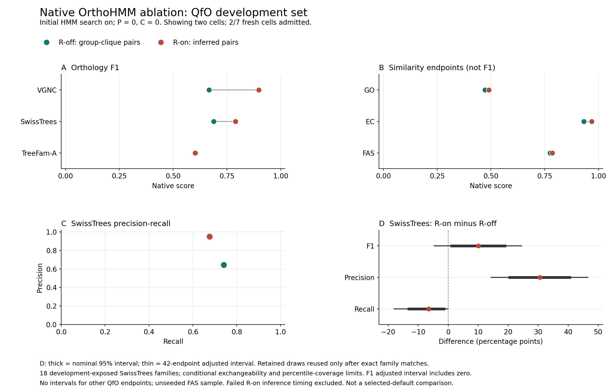
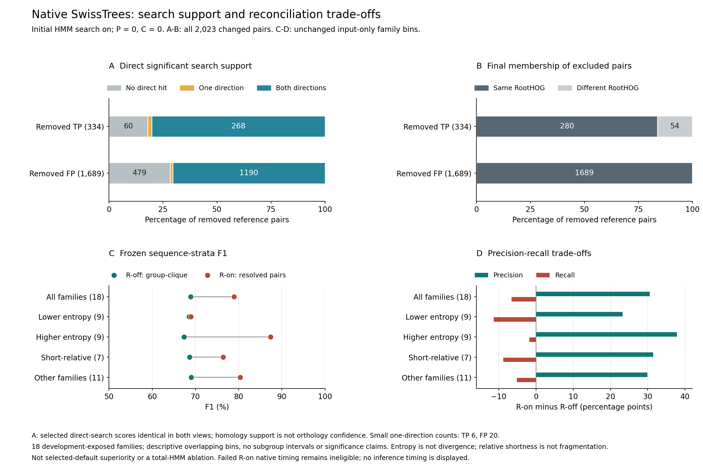

# OrthoHMM Native QfO Supplement

Working manuscript supplement, 6 October 2026. Not submission-ready. Generated from existing verified reports; no new inference, scoring, accuracy admission, bootstrap or timing repair. Historical main text and archive bytes are unchanged. This document supplements, not supersedes, their frozen methods and all-tool results.

## Methods And Evidence Scope

P0/C0/R0 and P0/C0/R1 retain initial HMM search; downstream profile refinement and candidate expansion are off. R changes group-derived cross-species clique predictions to native phylogenetically inferred pairs. This is not a total-HMM ablation, the selected-default high-sensitivity/satellite_v2 comparison or a sensitivity-matched non-HMM control. QfO and OrthoBench remain development-exposed primary benchmarks; Three Kingdoms is supplementary.

Only 2 of 7 native QfO identities have supplied accuracy admissions. Missing from this snapshot: `p0_c1_r0`, `p0_c1_r1`, `p1_c0_r1`, `p1_c1_r0`, `p1_c1_r1`. Unavailable cells are not imputed and their interactions cannot be evaluated here. R1 accuracy was recovered after a native measurement failure; its inference resource values remain null and timing ineligible. Current job states belong in the progress ledger, not this fixed score snapshot.

Report and code identities are directly checked, with each diagnostic's original independent readback bound. Existing scientific receipts are reused; their raw scans and transitive admissions are not repeated for writing. Present-day checksum agreement is not evidence of uninterrupted integrity. [Score snapshot](../native_qfo_scientific_scores_20261006_v1/report.json).

## Native Endpoint Results

| Endpoint | Statistic | R0 | R1 |
| --- | --- | --- | --- |
| VGNC | F1 | 0.666834 | 0.898185 |
| SwissTrees | F1 | 0.689184 | 0.789574 |
| TreeFam-A | F1 | 0.605404 | 0.602508 |
| GO | Similarity | 0.472119 | 0.490260 |
| EC | Similarity | 0.932114 | 0.967702 |
| FAS | FAS | 0.774945 | 0.785007 |
| Six-metric mean | Secondary, not F1 | 0.690100 | 0.755539 |

VGNC, SwissTrees and TreeFam-A are F1 endpoints. GO/EC similarity and FAS are not F1. The six-metric arithmetic mean is project-defined and secondary, not official QfO F1 or a superiority ranking. Native serialized scores are retained rather than replaced by unrounded diagnostic arithmetic.

## SwissTrees Conditional Uncertainty

Paired intervals are attached only after every complete native family record matches the retained count manifest. The analysis reuses 100,000 family draws, seed 20260922, and correction over all 42 originally planned endpoints. It does not shrink multiplicity to the single available contrast or create new independent confirmation. The statistic is the harmonic mean of macro precision and recall, not mean family F1 or pooled pair F1.

| Metric | Change (pp) | Adjusted Lower | Adjusted Upper | Wins | Ties | Losses |
| --- | --- | --- | --- | --- | --- | --- |
| F1 | 10.039037 | -4.641773 | 24.419899 | 14 | 1 | 3 |
| PPV | 30.521187 | 14.325178 | 46.547258 | 16 | 1 | 1 |
| TPR | -6.533385 | -18.041319 | -0.043593 | 0 | 10 | 8 |

The adjusted F1 interval includes zero: a conclusive improvement is not established. The intervals are conditional on 18 development-exposed reference families, exchangeability and approximate percentile coverage. They do not apply to VGNC, TreeFam-A, GO, EC, FAS or the secondary mean. [Retained interval binding](../native_qfo_swiss_uncertainty_binding_22449_20261006.json).

## VGNC Precision-Recall Trade-Off

| Cell | TP | FP | FN | Precision | Recall | F1 |
| --- | --- | --- | --- | --- | --- | --- |
| p0_c0_r0 | 19981 | 16013 | 3953 | 0.555120 | 0.834837 | 0.666834 |
| p0_c0_r1 | 19518 | 9 | 4416 | 0.999539 | 0.815493 | 0.898185 |

| R0 | R1 | Pairs |
| --- | --- | --- |
| FN | FN | 3953 |
| FP | FP | 9 |
| FP | not_scored | 16004 |
| TP | FN | 463 |
| TP | TP | 19518 |

The actual native scored-pair union retains all category changes, not historical selected-default counts. `not_scored` is not a TN or biological non-orthology label. Shared-protein reference labels form overlap blocks; neither these blocks nor method-dependent prediction components establish independent biological units. Rare-error/shared-clade uncertainty-validation failures remain unresolved; no arbitrary block bootstrap is used. Full prediction-database hashes were checked before and after reference-mapping reads, but prediction edges were not requeried and omitted-FP completeness was not independently rescored. [Native decomposition](../native_qfo_vgnc_blocks_20261006_v1/report.json).

## SwissTrees Pair And Stage Localization

| R0 | R1 | Pairs |
| --- | --- | --- |
| FN | FN | 1193 |
| FP | FP | 19 |
| FP | TN | 1689 |
| TN | TN | 4741 |
| TP | FN | 334 |
| TP | TP | 2789 |

These pair counts describe all scored reference relations; they are not the macro F1 denominator. Every changed pair was traced, avoiding selection of representative successes. [Pair transitions](../native_qfo_swiss_pair_transitions_20261006_v2.json).

| Cell | Removed | Direct_edge | Indirect_path | Disconnected |
| --- | --- | --- | --- | --- |
| p0_c0_r0 | TP | 270 | 64 | 0 |
| p0_c0_r0 | FP | 1137 | 552 | 0 |
| p0_c0_r1 | TP | 270 | 64 | 0 |
| p0_c0_r1 | FP | 1137 | 552 | 0 |

A direct graph edge or within-family path is observed homology support, not true orthology, a causal recruitment test or evolutionary distance. Full candidate-family members, including same-species and non-reference genes, were eligible intermediates. All changed pairs without a direct significant hit had indirect graph paths; direct-hit absence alone does not isolate a prefilter failure. The combined final graph does not isolate reciprocal-best-normalized-hit and singleton-attachment decisions. [Search evidence](../native_qfo_swiss_search_support_20261006_v1.json); [Graph evidence](../native_qfo_swiss_graph_support_20261006_v1/report.json).

All changed pairs share their original candidate family and have an exclusion LCA annotated as a duplication under the saved positive-paralogy rule. Some excluded true pairs lie within the same final root HOG: inspecting only split groups misses those exclusions. Saved Newicks independently reproduce LCAs, but inferred duplication annotations and node confidence are not validated biological histories. Graphs and node annotations were not inventoried by the original validators; later observed bytes cannot be promoted into original admission. [Reconciliation localization](../native_qfo_swiss_reconciliation_trace_20261006_v1.json).

## Prespecified Sequence Strata

| Input-Only Bin | Families | F1 Change (pp) | Precision Change | Recall Change |
| --- | --- | --- | --- | --- |
| higher_entropy | 9 | 19.973579 | 37.818321 | -1.749082 |
| lower_entropy | 9 | 0.420134 | 23.224053 | -11.317689 |
| not_short_relative | 11 | 11.380692 | 29.920385 | -5.121208 |
| short_relative | 7 | 7.731014 | 31.465305 | -8.752521 |

Unchanged September input-only bins describe associations, not validated subgroup effects or mechanisms. Global residue entropy is not divergence or local low complexity; relative shortness does not prove fragmentation. Empty bins remain unavailable in the complete generated table. No subgroup CI, tuning or default promotion follows. [Complete native projections](../native_qfo_swiss_sequence_strata_20261006_v1/report.json).

## Functional Scores And Pair Selection

| Endpoint | R0_scored_pairs | R1_scored_pairs | Shared | Changed_shared_scores |
| --- | --- | --- | --- | --- |
| GO | 145142 | 78607 | 78607 | 0 |
| EC | 186098 | 116929 | 116929 | 0 |
| FAS | 38205 | 252451 | 1007 | 0 |

Every R1 GO/EC scored pair is present in R0 with the same six-decimal serialized score. Their higher native means therefore reflect changed scored-pair membership and denominators at retained precision, not improved values on shared pairs. This does not prove orthology correctness or full-precision equality. FAS rows are realized samples, not all eligible predictions; their small shared subset, unseeded method-specific mixtures and missing-score attrition do not identify inclusion probabilities or support a paired population CI. [Functional composition](../native_qfo_functional_pair_composition_20261006_v1.json).

## Verified Companion Figures

[Vector PDF](../native_qfo_p0c0_figure_20261006_v1/native_qfo_p0c0.pdf). Native P0/C0 endpoint scores and the conditional SwissTrees reconciliation contrast. F1 uncertainty remains inconclusive; other endpoints are point estimates without validated difference intervals.

[Vector PDF](../native_qfo_swiss_mechanism_figure_20261006_v3/native_swiss_mechanism.pdf). Complete SwissTrees exclusions, direct significant-search evidence and unchanged input-only strata. This earlier companion does not depict the subsequent graph/VGNC diagnostic; those are reported above.

## Claim Boundaries And Remaining Work

Supported: the two admitted native cells and their explicit precision-recall/selection differences; conditional SwissTrees interval reuse; complete observed error-stage localization. Not established: conclusive native F1 superiority, verified evolutionary causes, total-HMM advantage, isolated efficiency or genome-wide generalization.

Timing measurements were collected on a shared Threadripper while other analyses were running. Competition for CPU, memory bandwidth and I/O may have affected elapsed times, with an unknown and potentially tool-dependent impact. These are observed shared-host timings, not estimates of isolated performance. Matching resource limits does not isolate speed; failed R1 timing remains ineligible. This supplement does not create a new timing panel.

Remaining work includes the missing native identities and interactions, sensitivity-matched search, valid wider uncertainty, independent-generalization limitations, remaining error strata, original TreeFam files and all-tool provenance/resource gaps. The full manuscript, executable archive/release and external-deposition scope remain unfinished. No dedicated host or quiet window is required; safe capacity and valid accounting still apply.

## Direct Evidence Index

- [snapshot](../native_qfo_scientific_scores_20261006_v1/report.json)
- [intervals](../native_qfo_swiss_uncertainty_binding_22449_20261006.json)
- [functional](../native_qfo_functional_pair_composition_20261006_v1.json)
- [functional reader](../native_qfo_functional_pair_sql_readback_20261006.json)
- [transitions](../native_qfo_swiss_pair_transitions_20261006_v2.json)
- [transitions reader](../native_qfo_swiss_pair_transition_sql_readback_20261006.json)
- [reconciliation](../native_qfo_swiss_reconciliation_trace_20261006_v1.json)
- [reconciliation reader](../native_qfo_swiss_reconciliation_newick_readback_20261006.json)
- [search](../native_qfo_swiss_search_support_20261006_v1.json)
- [search reader](../native_qfo_swiss_search_support_code_readback_20261006.json)
- [graph](../native_qfo_swiss_graph_support_20261006_v1/report.json)
- [graph reader](../native_qfo_swiss_graph_floyd_readback_20261006.json)
- [strata](../native_qfo_swiss_sequence_strata_20261006_v1/report.json)
- [strata reader](../native_qfo_swiss_sequence_strata_readback_20261006.json)
- [vgnc](../native_qfo_vgnc_blocks_20261006_v1/report.json)
- [vgnc reader](../native_qfo_vgnc_blocks_readback_20261006_v1.json)
- [score figure](../native_qfo_p0c0_figure_20261006_v1/manifest.json)
- [score figure reader](../native_qfo_p0c0_figure_readback_20261006.json)
- [mechanism figure](../native_qfo_swiss_mechanism_figure_20261006_v3/manifest.json)
- [mechanism figure reader](../native_qfo_swiss_mechanism_figure_readback_20261006_v3.json)
