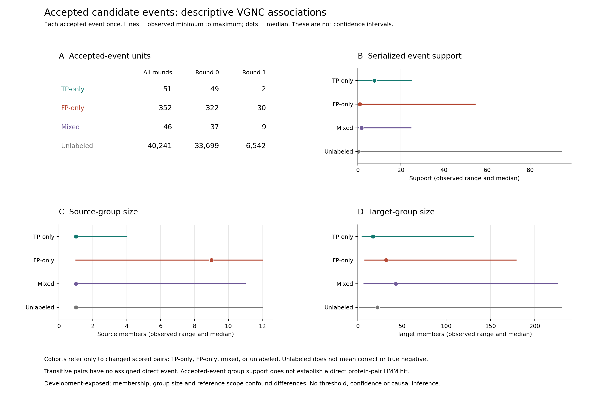

# Accepted Candidate Events: VGNC Support Diagnostic

## Methods

This supplementary diagnostic joins the original accepted candidate-event trace to already-verified changed VGNC pair paths. It reuses the complete partition and original-protein identity evidence, without reexecuting inference, aliases, grouping or scoring. Every accepted event contributes once to feature summaries, irrespective of the number of dependent scored pairs it introduces. TP-only events have recovered asserted TPs but no added scored FPs; FP-only events have the converse; mixed events affect both. Events without a changed scored VGNC pair are unlabeled, not true negatives or biologically correct events.

The exporter validates every accepted event, its round, nonoverlapping memberships, declared sizes, unique semantic identity and numeric features. All direct pair joins check named endpoints and the first-connection round. Transitive paths retain no direct event or assigned direct-event feature. A separate standard-library reader imports neither exporter nor union kernel and reconstructs joins, tables and rational summary statistics. Identities and integer counts agree exactly; numerical summaries use absolute and relative tolerance 1e-12. All source, input and output byte bindings are checked before and after each original diagnostic command.

Feature summaries contain finite minimum, median, mean and maximum, missing counts and positive-infinity counts. All required features are present. The serialized positive-infinity margin denotes no positive alternative; it is counted separately and excluded from finite summaries, not replaced with a large number. No cutoff fitting, significance tests, bootstrap intervals or default tuning is performed.

## Results

The trace contains 40,690 accepted events. The ledger retains all 2,295 changed pair paths; 449 distinct events directly implicate changed scored pairs.

| Cohort | Accepted events | Round 0 | Round 1 | Median support | Finite median margin | Positive-infinity margins |
|---|---:|---:|---:|---:|---:|---:|
| TP-only | 51 | 49 | 2 | 7.682283 | 2.027995 | 12 |
| FP-only | 352 | 322 | 30 | 0.984776 | 2.678003 | 55 |
| Mixed | 46 | 37 | 9 | 1.708556 | 2.329948 | 10 |
| Unlabeled | 40,241 | 33,699 | 6,542 | 0.273256 | 2.484760 | 20,423 |

Direct paths account for 150 recovered TPs and 2,033 added scored FPs. The remaining 12 recovered TPs and 100 added FPs have transitive paths. These are dependent pair counts, not independent event units.

Figure S1. Counts use each accepted event once. Lines show observed minimum to maximum and dots show medians, not confidence intervals. Feature ranges overlap; group-level support does not imply calibrated assignment confidence. The source and target sizes are retained serialized memberships.

## Interpretation And Limitations

The descriptive cohort support ranges overlap, and mixed events affect both recovered TPs and added FPs. Higher median support in one cohort is not a validated decision boundary or a demonstrated accuracy gain. Membership, group size, reference scope and conditioning on accepted events confound differences. This analysis does not inspect rejected alternatives, recompute eligibility/support criteria, establish a direct pairwise HMM hit, isolate a biological cause, provide independent VGNC uncertainty or supply independent validation. It neither changes defaults nor demonstrates superiority over OrthoFinder or any other tool.

These analyses use development-exposed QfO observations. Failed R-on timing remains ineligible. Diagnostic postprocessing observations were collected on a shared Threadripper and are not native inference timings or isolated-performance estimates. The full publication goal remains incomplete. This companion does not modify or supersede the retained main manuscript, rc5 delivery, scientific admissions or earlier failed outcomes.

## Claim-To-Evidence Checklist

| Claim | Scope | Evidence |
|---|---|---|
| All changed pair identities and paths retained | Descriptive changed-pair ledger | [annotated_pairs.tsv](annotated_pairs.tsv) |
| Event units counted once, including mixed and unlabeled | Accepted events only | [event_cohorts.tsv](event_cohorts.tsv) |
| Finite summaries separate positive-infinity margin | Serialized features, not calibrated confidence | [feature_summaries.tsv](feature_summaries.tsv) |
| Direct and transitive changes distinguished | No invented direct event for transitive pairs | [pair_paths.tsv](pair_paths.tsv) |

Machine-readable [claim bindings](claims.json), [original diagnostic report](report.json), [independent verification](readback.json), [unique implicated events](implicated_events.tsv), [execution receipt](execution.json) and [prospective protocol](protocol.md) accompany this supplement. Presence and hash checking do not imply full inference reproduction, transitive dependency closure, permissions or archival readiness.
