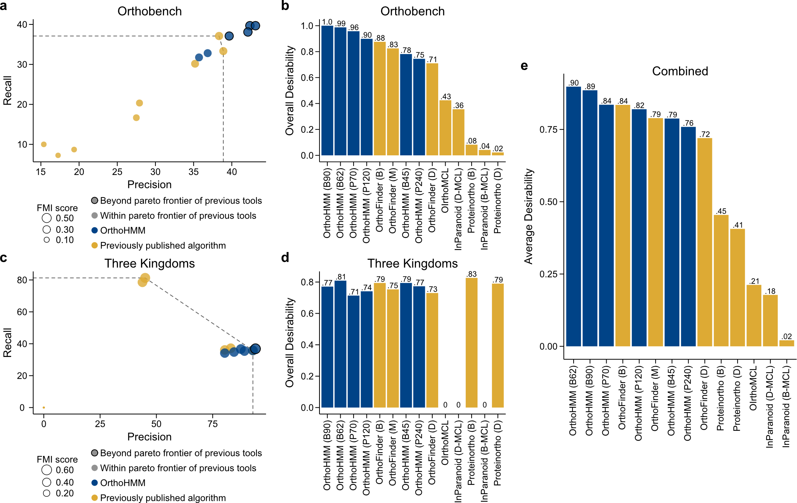

.. _performance:

Performance Assessment
======================

In brief, performance assessment and comparison of multiple trimming alignment software
revealed that OrthoHMM is a top-performing software.

**OrthoHMM outperforms other algorithms across two benchmarking datasets.**
(a) Examination of various algorithms across the three-performance metrics (precision
[x-axis], recall [y-axis], and Fowlkes-Mallows Index [FMI] score [data point size]) using
the OrthoBench dataset revealed four variants of OrthoHMM outperformed other algorithms.
(b) Desirability-based ranking, which aggregates precision, recall, and FMI score,
revealed OrthoHMM using the BLOSUM90, BLOSUM62, PAM70, and PAM120 substitution matrices
outperformed all other approaches. (c) Examination of the same performance metrics in the
Three Kingdoms dataset revealed that one variant of OrthoHMM surpassed the pareto
frontier of previous tools. (d) Desirability-based ranking corroborated OrthoHMM is a
top-performing algorithm. (e) The average desirability scores in the OrthoBench and
Three Kingdoms datasets revealed OrthoHMM with the BLOSUM62 and BLOSUM90 substitution
matrices outperformed all other approaches. In panels a and c, the pareto frontier of
previous tools is represented as a dashed line.

In panels b, d, and e, the abbreviations
in the paratheses provide additional information about orthology inference parameters and
are as follows: B45, BLOSUM45; B62, BLOSUM62; B90, BLOSUM90; P70, PAM70; P120, PAM120;
P240, PAM240; B, BLAST; D, DIAMOND; D-MCL, DIAMOND and Markov clustering; and B-MCL,
BLAST and Markov clustering. OrthoHMM is depicted in blue; other algorithms are depicted
in gold.

For additional details about performance assessment, please see *OrthoHMM: Improved
Inference of Ortholog Groups using Hidden Markov Models*. Steenwyk et al. bioRxiv.
doi: |doiLink|_.

.. _doiLink: https://journals.plos.org/plosbiology/article?id=10.1371/journal.pbio.3001007
.. |doiLink| replace:: COMING SOON
